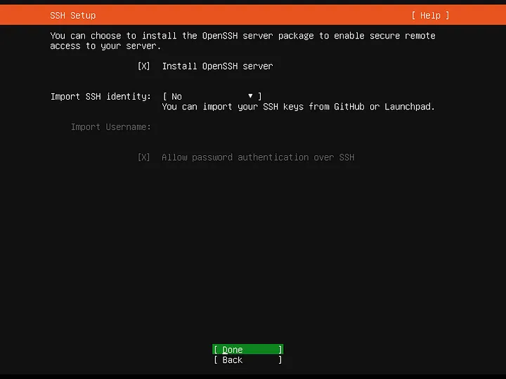
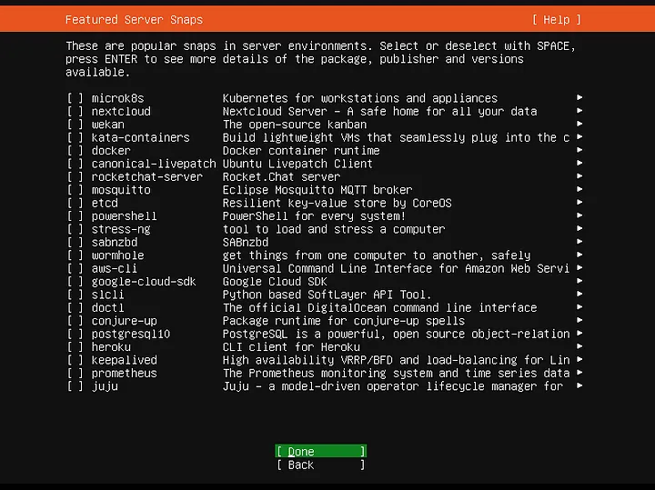

## Setting up a Kubernetes (K8s) Cluster on the Systopya Lab machines

This README reports my steps to create a K8s Cluster.

The requirements for its execution are the following:

## Requirements

* A set of nodes  
* A network between the nodes using a bridge. The Equipment Tsar (systopia-equipment@cs.ubc.ca) can provide it.

The hardware adopted was the following: 

## Hardware and software adopted

* 4 nodes (leapx19, leapx20, leapx21, leapx22) 
  * Operational System (OS): Ubuntu 22.04
  * 64GB RAM
  * 32 Cores
  * 500 GB
* 32 VMs
  * Operational System (OS): Ubuntu 20.04 # I used an old version for compatibility reasons. 
  * 6GB de RAM
  * 2 CPUS 
  * 60 GB
* VirtualBox (VB) 7.0.12
  * VB Extesion Pack 7.0.12
  * rdesktop
* Kubernetes 1.2.7  # I used an old version for compatibility reasons. 
* Docker 1.9.3 # I used an old version for compatibility reasons. 


## Install and configure the virtual machines (VMs)

The first step is to install all VMs. The following softwares need to be install on each node:

* Virtual Box (VB)
* VB Dependencies
* VB Extension Pack

### Install VB Dependencies

 > sudo apt update -y; sudo apt upgrade -y; sudo apt install -y linux-headers-$(uname -r) dkms;

### VB Installation

```
wget https://download.virtualbox.org/virtualbox/7.0.12/virtualbox-7.0_7.0.12-159484~Ubuntu~jammy_amd64.deb;
sudo dpkg -i virtualbox-7.0_7.0.12-159484~Ubuntu~jammy_amd64.deb;
sudo apt install -f;
VBoxManage --version;
```

## Install VB Extension Pack

The VB Extension Pack provide remote access to VMs during installation.

### Download and install the VB Extension Pack and check its installations

```
wget https://download.virtualbox.org/virtualbox/7.0.12/Oracle_VM_VirtualBox_Extension_Pack-7.0.12.vbox-extpack
sudo VBoxManage extpack install Oracle_VM_VirtualBox_Extension_Pack-7.0.12.vbox-extpack
VBoxManage list extpacks
```

Your output has to be: 

<pre>
Extension Packs: 1
Pack no. 0:   Oracle VM VirtualBox Extension Pack
Version:        7.0.12
Revision:       159484
Edition:        
Description:    Oracle Cloud Infrastructure integration, Host Webcam, VirtualBox RDP, PXE ROM, Disk Encryption, NVMe, full VM encryption.
VRDE Module:    VBoxVRDP
Crypto Module:  VBoxPuelCrypto
<b>Usable:         true</b>
</pre>

## Download the Operating System (OS)

> [!WARNING]
> An Ubuntu OS was used in this report. If you use an non debian based OS,e.g., Cent OS, you need to modify the commands as necessary.

> wget https://releases.ubuntu.com/focal/ubuntu-20.04.6-live-server-amd64.iso

## Create your first VM

The following script installs an *Ubuntu* VM called *Leapx191* with *6GB* of RAM, *2* CPUS, and *60GB* of hard disk using a file called *ubuntu-20.04.6-live-server-amd64.iso*. It uses two networks, NAT (provides internet) and bridge (provides communication between different hosts). 


### Installation script 

If you have others requirements, you must to modify the script. The points to be modified are the following:

* *VM name* 
  * **Each VM needs its own name.** 
* *OS type* 
  * **You can use: *VBoxManage list ostypes* to see types available.**
* *Memory size* 
* *Number of CPUs* 
* *Bridge network name*
  * It is the name of the bridge network interface that the Equipment Tsar configured.
* *Disk size* 
* *OS filename*

The script below is the one use to create the leapx191 VM. 

<pre>
#!/bin/bash
MACHINENAME=<i>Leapx191</i> # Name of the VM

# Create a VM and put their files into the same folder
VBoxManage createvm --name $MACHINENAME --ostype "<i>Ubuntu_64</i>" --register --basefolder `pwd`  # OS type

# Set memory and network
VBoxManage modifyvm $MACHINENAME --ioapic on
VBoxManage modifyvm $MACHINENAME <i>--memory 6144 --cpus 2</i> --vram 128 # Memory size and CPUs
VBoxManage modifyvm $MACHINENAME --nic1 nat
VBoxManage modifyvm leapx191 --nic2 bridged <i>--bridgeadapter2 wellisonbridge0</i> # Bridge adapter name

# Create the disk and connect Ubuntu Iso
VBoxManage createhd --filename `pwd`/$MACHINENAME/$MACHINENAME_DISK.vdi <i>--size 61440</i> --format VDI # Disk Size
VBoxManage storagectl $MACHINENAME --name "SATA Controller" --add sata --controller IntelAhci
VBoxManage storageattach $MACHINENAME --storagectl "SATA Controller" --port 0 --device 0 --type hdd --medium  `pwd`/$MACHINENAME/$MACHINENAME_DISK.vdi
VBoxManage storagectl $MACHINENAME --name "IDE Controller" --add ide --controller PIIX4
VBoxManage storageattach $MACHINENAME --storagectl "IDE Controller" --port 1 --device 0 --type dvddrive <i>--medium `pwd`/ubuntu.iso</i> # OS Filename
VBoxManage modifyvm $MACHINENAME --boot1 dvd --boot2 disk --boot3 none --boot4 none

#Enable RDP
VBoxManage modifyvm $MACHINENAME --vrde on
VBoxManage modifyvm $MACHINENAME --vrdemulticon on --vrdeport 10001

#Start the VM
VBoxHeadless --startvm $MACHINENAME
</pre>

### Save the script into a .sh file

Put the script into a sh file using any editor such as nano, vim, and so on. For instance:
>  nano script_vm.sh

### Give execute permission to the file

> chmod +x script_vm.sh
 
### Execute the script

> ./script_vm.sh

The VM will boot and wait for the OS to be installed.

## Install the OS 

We need to use our computer to access the VM remotely to install the OS. VB recommends rdesktop, however, there are a lot of softwares to do it, such as: [remmina](https://remmina.org/), [krdc](https://apps.kde.org/krdc/) and [rdesktop](http://www.rdesktop.org/). 

For Ubuntu distros, the easy package is rdesktop:  

### Install Rdesktop

> apt -y install rdesktop

### Create an SSH tunnel between your computer and the node.

> [!TIP]
> You will likely be using csremote as a jump host. To make this command easier to access, try configuring the .config file in ssh. Refer to [config](##How-to-configure-the-.config-file) for details. 

This command is used when you do not have the ssh .config file configured.

> ssh -L 10001:systopia_node:10001 your_cwl_user@remote.cs.ubc.ca 

This command is used when you do have the ssh .config file configured.

> ssh -L 10001:systopia_node:10001 csremote 

###  Access the VM

> rdesktop -a 16 -N localhost:10001

### Install the VM

Most of the OS instalattion steps are quite easy. For instance, choice of keyboard and installer update. 
If you have any doubts, please refer to [Ubuntu Server Installation.](https://ubuntu.com/tutorials/install-ubuntu-server#1-overview)

The tricky configuration is the VM bridge network, which will be following detailed:

#### Configure the Bridge Network

The networking configuration screen has two network interfaces. 
The Host-only network (10.0.2.15) provide internet for the VMs.
The bridge network must provide communication with the VMs on others nodes. 
The Host-only network is configured by default. 

To configure the bridge, go to bridge network interface -> edit IPv4 -> manual mode -> enter subnet and IP.

To check the IP range of the bridge network, use the ifconfig command in the **node**. You may need to install net-tools to use this command.

```
apt install -y net-tools
ifconfig
```

My output was: 


```
wellisonbridge0: flags=4163<UP,BROADCAST,RUNNING,MULTICAST>  mtu 1500
        inet 172.30.1.19 netmask 255.255.255.0  broadcast 172.30.1.255
        inet6 fe80::544f:9ff:fe33:31e8  prefixlen 64  scopeid 0x20<link>
        ether 56:4f:09:33:31:e8  txqueuelen 1000  (Ethernet)
        RX packets 201468579  bytes 109802010325 (109.8 GB)
        RX errors 0  dropped 0  overruns 0  frame 0
        TX packets 186309880  bytes 187818417622 (187.8 GB)
        TX errors 0  dropped 0 overruns 0  carrier 0  collisions 0
```

As you can see, my node bridge IP is: **172.30.1.19**. Therefore, 

**Subnet**: 172.30.1.0/24 <br>
**VM Bridge IP**: 172.30.1.221 <br>

I choose **172.30.1.221** to a VM called leapx221. You need to choose an IP not yet allocated and the range 1-255. **The other fields (e.g., DNS and gateway) do not need to be filled in.** Finally, save the settings. 

You also need to check the SSH option to allow SSH remote access after installation. This option may vary depending on the OS. 



There is no need to install any packages. We will perform manual installations after installing the VM. 



Once the OS has been installed, it will update the system with any that are required and then you’ll be prompted to reboot.

### Login

You’re officially done however for the sake of completion, lets log in. Once it has rebooted you should see the screen below, enter your username and press enter. You’ll then be prompted for the password you set during install.

**When you type the password, it will not show on screen but don’t worry, it is being entered.**

Press enter when done and you’ll see a load of text outputted, this is the message of the day, and a flashing cursor next to ~$

**Welcome to the shell (bash).**

### Post installation

After the installation and the VM has restarted, stop the VM in the node using control + C if you still have the run terminal. Otherwise, run: 

> VBoxManage controlvm leapx191 acpipowerbutton

Then, remove the remote virtualization property so the port is not blocked for the next installation.

> VBoxManage modifyvm leapx191 --vrde off # You not gonna be able to acess VM by rdesktop

Then, start the machine. 

> VBoxManage startvm leapx191 --type headless;

You can already connect to the server via SSH as we installed the package during install. You will be able to access the VM using the configured bridge IP if you are in a host or VM also present on the bridge network. 

> ssh leapx191@172.30.1.191

You can also create [forwarding rules](https://www.virtualbox.org/manual/ch06.html#natforward) to redirects an open port of the host machine to the VM. However, I believe that using the bridge network is the easiest way.

You can also place VMs in the config file to make login easier. To do this, use the node (i.e., leapx19) as jumphost for the VM (i.e., leapx191). 

My config ssh file:

```
host leapx191
     IdentityFile ~/.ssh/id_rsa
     ProxyJump    leapx19
     User         leapx191
     Hostname 172.30.1.191
```

### Final Notes

Repeat the steps described previously to install as many VMs as necessary.

#### Some Tips

1. You can install several machines at the same time. However, you need to allocate a different VRDE port for each virtual machine (second to last command line in the script). Furthermore, you need a tunnel for each port used:

For instance:

```
ssh -L 10001:host:10001 user@remote.cs.ubc.ca # For VM 1
ssh -L 10002:host:10002 user@remote.cs.ubc.ca # For VM 2
```


2. Cloning is another alternative. However, you will need for each cloned machine to modify the clone IP so as not to cause any conflicts. More information about this method is available on the [official VB website](https://docs.oracle.com/en/virtualization/virtualbox/7.0/user/vboxmanage.html#vboxmanage-clonevm).

## Install K8s and Docker

You need to install K8s and Docker in each VM in the cluster. 

## Docker

To install Docker I used the ubuntu PPA method.

> [!TIP]
> PPA repositories can be discontinued. Other alternatives to download and install Docker are available on the [official page](https://docs.docker.com/engine/install/ubuntu/).

Add Docker's official GPG key.

```
sudo apt-get update
sudo apt-get install ca-certificates curl gnupg
sudo install -m 0755 -d /etc/apt/keyrings
curl -fsSL https://download.docker.com/linux/ubuntu/gpg | sudo gpg --dearmor -o /etc/apt/keyrings/docker.gpg
sudo chmod a+r /etc/apt/keyrings/docker.gpg
```

Add the repository to apt sources:

```
echo \
  "deb [arch=$(dpkg --print-architecture) signed-by=/etc/apt/keyrings/docker.gpg] https://download.docker.com/linux/ubuntu \
  $(. /etc/os-release && echo "$VERSION_CODENAME") stable" | \
  sudo tee /etc/apt/sources.list.d/docker.list > /dev/null
  
sudo apt-get update
```

> [!NOTE] 
> If you use an Ubuntu derivative distro, such as Linux Mint, you may need to use UBUNTU_CODENAME instead of VERSION_CODENAME.


To install the latest version, run:

> sudo apt-get install docker-ce docker-ce-cli containerd.io docker-buildx-plugin docker-compose-plugin

To install a specific version of Docker Engine, start by listing the available versions in the repository:

```
apt-cache madison docker-ce | awk '{ print $3 }'

5:24.0.0-1~ubuntu.22.04~jammy
5:23.0.6-1~ubuntu.22.04~jammy
```

Select the desired version and install:

```
VERSION_STRING=5:24.0.0-1~ubuntu.22.04~jammy
sudo apt-get install docker-ce=$VERSION_STRING docker-ce-cli=$VERSION_STRING containerd.io docker-buildx-plugin docker-compose-plugin
```

Verify that the Docker Engine installation is successful by running the **hello-world** image:

> sudo docker run hello-world

This command downloads a test image and runs it in a container. When the container runs, it prints a confirmation message and exits.

Your output has to be: 

```
Hello from Docker!
This message shows that your installation appears to be working correctly.
```

If you receive this message, you have now **successfully** installed and started Docker Engine.

## K8s

To install K8s I used the Ubuntu PPA method. 

> [!WARNING]
> PPA repositories can be discontinued. Others alternative to download and install K8s (i.e., kubeadm, kubelet and kubectl) are available on the [official page](https://kubernetes.io/docs/tasks/tools/install-kubectl-linux/).


Update the apt package index and install packages needed to use the K8s apt repository

```
sudo apt update
sudo apt install -y apt-transport-https ca-certificates curl
```

Download the public signing key for the Kubernetes package repositories. The same signing key is used for all repositories so that you can disregard the version in the URL.  If you want to use a K8s version different than **v1.29**, replace **v1.29** with the desired minor version in the commands below:

> curl -fsSL https://pkgs.k8s.io/core:/stable:/v1.29/deb/Release.key | sudo gpg --dearmor -o /etc/apt/keyrings/kubernetes-apt-keyring.gpg 

Add the appropriate K8s apt repository.

> echo 'deb [signed-by=/etc/apt/keyrings/kubernetes-apt-keyring.gpg] https://pkgs.k8s.io/core:/stable:/v1.29/deb/ /' | sudo tee /etc/apt/sources.list.d/kubernetes.list

Update apt package index, then install kubectl, kubeadm and kubelet.

```
sudo apt update
sudo apt install -y kubectl kubeadm kubelet
```

For kubeadm to work properly, you need to disable swap on all the nodes using the following command.

> sudo swapoff -a

To desabilite swap forever, comment swap line into /etc/fsta. The fstab entry comment will make sure the swap is off on system reboots.

> sudo nano /etc/fstab

Before: 

<pre>
...
/dev/disk/by-uuid/27B9-22B9 /boot/efi vfat defaults 0 1
/swap.img	none	swap	sw	0	0 # This line
</pre>

After:

<pre>
...
/dev/disk/by-uuid/27B9-22B9 /boot/efi vfat defaults 0 1
#/swap.img	none	swap	sw	0	0 # This line
</pre>

Finally, add hold to the packages to prevent upgrades.

> sudo apt-mark hold kubelet kubeadm kubectl


> sudo kubectl version

Your output has to be:

```
Client Version: version.Info{Major:"1", Minor:"27", GitVersion:"v1.27.9", GitCommit:"d15213f69952c79b317e635abff6ff4ec81475f8", GitTreeState:"clean", BuildDate:"2023-12-19T13:41:13Z", GoVersion:"go1.20.12", Compiler:"gc", Platform:"linux/amd64"}
Kustomize Version: v5.0.1
Server Version: version.Info{Major:"1", Minor:"27", GitVersion:"v1.27.9", GitCommit:"d15213f69952c79b317e635abff6ff4ec81475f8", GitTreeState:"clean", BuildDate:"2023-12-19T13:32:15Z", GoVersion:"go1.20.12", Compiler:"gc", Platform:"linux/amd64"}
```


### Configure a rede das máquinas virtuais

As a prerequisite for setting up the K8s Cluster, it is necessary to configure bridge network forwarding on each VM. To do that, you need to edit the file: **/etc/netplan/00-installer-config.yaml** 

Add the routes in the Bridge Network Interface.

<pre>
network:
  ethernets:
    enp0s3:
      dhcp4: true
    enp0s8: # Bridge Network Interface
      addresses:
      - 172.30.1.191/24
      routes: # add this
        - to: 10.96.0.1/32 # add this
          via: 172.30.1.1 #  # add this
        search: []
  version: 2
</pre>
> [!WARNING]
> Your VM's bridge IP address may be different. So, add your values!

Configure the bridge network's IP to the Kubernetes node's IP when it is part of the Cluster by editing the /usr/lib/systemd/system/kubelet.service.d

> sudo nano /usr/lib/systemd/system/kubelet.service.d/10-kubeadm.conf

Add this line to the file, where 172.30.1.191 is the VM IP.

> Environment="KUBELET_EXTRA_ARGS=--node-ip=172.30.1.191" 

10-kubeadm.conf file after insertion:

<pre>
[Service]
Environment="KUBELET_KUBECONFIG_ARGS=--bootstrap-kubeconfig=/etc/kubernetes/bootstrap-kubelet.conf --kubeconfig=/etc/kubernetes/kubelet.conf"
Environment="KUBELET_CONFIG_ARGS=--config=/var/lib/kubelet/config.yaml"
<b>Environment="KUBELET_EXTRA_ARGS=--node-ip=172.30.1.191"</b> 
# This is a file that "kubeadm init" and "kubeadm join" generates at runtime, populating the KUBELET_KUBEADM_ARGS variable dynamically
EnvironmentFile=-/var/lib/kubelet/kubeadm-flags.env
# This is a file that the user can use for overrides of the kubelet args as a last resort. Preferably, the user should use
# the .NodeRegistration.KubeletExtraArgs object in the configuration files instead. KUBELET_EXTRA_ARGS should be sourced from this file.
EnvironmentFile=-/etc/default/kubelet
ExecStart=
ExecStart=/usr/bin/kubelet $KUBELET_KUBECONFIG_ARGS $KUBELET_CONFIG_ARGS $KUBELET_KUBEADM_ARGS $KUBELET_EXTRA_ARGS
</pre>

> ![!WARNING] Remember, each machine has a different IP. Use the correct IP for each VM.

Then restart the kubelet service: 

```
sudo systemctl daemon-reload
sudo system restart kubelet
```

### Initialize Kubeadm On Master Node To Setup Control Plane

At this point, we need to define the Cluster architecture. You need to choose which VM will be the master and which will be the workers.

I chose the leapx191 VM as master. On the leapx191 VM, run:

> sudo kubeadm init --apiserver-advertise-address=IP_MASTER_VM

```
mkdir -p $HOME/.kube
sudo cp -i /etc/kubernetes/admin.conf $HOME/.kube/config
sudo chown $(id -u):$(id -g) $HOME/.kube/config
```

Verify the kubeconfig by executing the following kubectl command to list all the pods in the kube-system namespace.

> sudo kubectl get pod -n kube-system


You can get the cluster info using the following command.

> sudo kubectl cluster-info 

### Install Waeve Network Plugin for Pod Networking

Kubeadm does not configure any network plugin. 
You need to install a [network plugin](https://kubernetes.io/docs/concepts/cluster-administration/addons/) of your choice for kubernetes pod networking and enable network policy.

I am using the Weave network plugin for this setup.

> sudo kubectl apply -f https://github.com/weaveworks/weave/releases/download/v2.8.1/weave-daemonset-k8s.yaml

After a few minutes, if you check the pods in the kube-system namespace, you will notice the Weave pods and CoreDNS pods running.
### Join Workers Nodes To Kubernetes Master Node

Let's connect the worker node to the master node by executing the Kubeadm join command that was provided when setting up the master node.

If you did not copy the join command, generate a new token on the master node to obtain the join command.

> sudo kubeadm token create --print-join-command

The output will be something like:

> sudo kubeadm join 172.30.1.191:6443 --token hichn4.ozo85g15upkbdqtd --discovery-token-ca-cert-hash sha256:4e3c9d324bb9a5e21d721c951df26182eb3b0c0913aa866d764472e981df8e6d

This command performs TLS initialization for the **workers**. 
When you run it, the **workers** will be part of the cluster.

If successful execution, you will see the output like: **This node has joined the cluster.**

Now execute the kubectl command from the master node to check if the node is added to the master.

> sudo kubectl get nodes

 
The output will be something like:

<pre>
NAME       STATUS   ROLES           AGE    VERSION
leapx191   Ready    control-plane   6d1h   v1.27.9
leapx192   Ready    <none>                6d1h   v1.27.9
leapx193   Ready    <none>                6d1h   v1.27.9
leapx194   Ready    <none>                6d1h   v1.27.9
leapx195   Ready    <none>                6d1h   v1.27.9
leapx196   Ready    <none>                6d1h   v1.27.9
leapx197   Ready    <none>                6d1h   v1.27.9
leapx198   Ready    <none>                6d1h   v1.27.9
</pre>

You can further add more nodes with the same join command. All further management and installation actions must be performed on the Master.

## Install the microservices applications


### Online Boutique

Clone the repository.

> git clone https://github.com/GoogleCloudPlatform/microservices-demo.git

Deploy Online Boutique to the cluster.

> kubectl apply -f ./release/kubernetes-manifests.yaml
   
Wait for the pods to be ready.

> kubectl get pods
 
After a few minutes, you should see the Pods in a Running state:

<pre>
NAME                                     READY   STATUS    RESTARTS   AGE
adservice-76bdd69666-ckc5j               1/1     Running   0          2m58s
cartservice-66d497c6b7-dp5jr             1/1     Running   0          2m59s
checkoutservice-666c784bd6-4jd22         1/1     Running   0          3m1s
currencyservice-5d5d496984-4jmd7         1/1     Running   0          2m59s
emailservice-667457d9d6-75jcq            1/1     Running   0          3m2s
frontend-6b8d69b9fb-wjqdg                1/1     Running   0          3m1s
loadgenerator-665b5cd444-gwqdq           1/1     Running   0          3m
paymentservice-68596d6dd6-bf6bv          1/1     Running   0          3m
productcatalogservice-557d474574-888kr   1/1     Running   0          3m
recommendationservice-69c56b74d4-7z8r5   1/1     Running   0          3m1s
redis-cart-5f59546cdd-5jnqf              1/1     Running   0          2m58s
shippingservice-6ccc89f8fd-v686r         1/1     Running   0          2m58s
</pre>

### TrainTicket

#### Install Helm

Download the Helm Version
> wget -c https://get.helm.sh/helm-v3.13.3-linux-amd64.tar.gz -O - | tar -xz

Find the helm binary in the unpacked directory, and move it to its desired destination

> mv linux-amd64/helm /usr/local/bin/helm

From there, you should be able to run the client and add the stable repo: helm help.

#### Install PVC supported

**Setup helm repository**

> helm repo add openebs https://openebs.github.io/charts

**Install OpenEBS helm chart with default values**

<pre>
helm repo update
helm install openebs --namespace openebs openebs/openebs --create-namespace
</pre>

The above commands will install OpenEBS Jiva and Local PV components in openebs namespace and chart name as openebs. To install and enable other engines you can modified the above command as follows:

**Verifying OpenEBS installation**

List the pods in <openebs> namespace

kubectl get pods -n openebs

<pre>
NAME                                           READY   STATUS    RESTARTS   AGE
openebs-localpv-provisioner-6b456b4c69-d9snh   1/1     Running   0          2d5h
openebs-ndm-4bdbp                              1/1     Running   0          2d5h
openebs-ndm-4kbtn                              1/1     Running   0          2d5h
openebs-ndm-5hx7g                              1/1     Running   0          2d5h
openebs-ndm-5qsv5                              1/1     Running   0          2d5h
openebs-ndm-7lv28                              1/1     Running   0          2d5h
openebs-ndm-7w27g                              1/1     Running   0          2d5h
openebs-ndm-7x2gw                              1/1     Running   0          2d5h
openebs-ndm-7xdch                              1/1     Running   0          2d5h
openebs-ndm-882c8                              1/1     Running   0          2d5h
openebs-ndm-9gr4l                              1/1     Running   0          2d5h
</pre>

**Patch the openebs storageclass to the local server.**

> kubectl patch storageclass openebs-hostpath -p '{"metadata": {"annotations":{"storageclass.kubernetes.io/is-default-class":"true"}}}'

#### Deploy TrainTicket

Clone the Repository

<pre>
git clone --depth=1 https://github.com/FudanSELab/train-ticket.git 
cd train-ticket/
</pre>

Deploy the application

> make deploy DeployArgs="--with-tracing --with-monitoring"

Run kubectl get pods to see pods are in a ready state

<pre>
NAME                                            READY   STATUS    RESTARTS        AGE
elasticsearch-5b468f5b4c-gpdsz                  1/1     Running   0               2d4h
nacos-0                                         1/1     Running   0               2d4h
nacos-1                                         1/1     Running   0               2d4h
nacos-2                                         1/1     Running   0               2d4h
nacosdb-mysql-0                                 3/3     Running   0               2d5h
nacosdb-mysql-1                                 3/3     Running   0               2d4h
nacosdb-mysql-2                                 3/3     Running   0               2d4h
rabbitmq-86666cf677-hkhvx                       1/1     Running   0               2d4h
skywalking-889f545fc-snbd9                      1/1     Running   5 (2d4h ago)    2d4h
skywalking-ui-676fbc4488-tlnjd                  1/1     Running   0               2d4h
ts-admin-basic-info-service-7f789d549-fkpb6     1/1     Running   0               2d4h
ts-admin-order-service-5786b794bc-whdbs         1/1     Running   0               2d4h
ts-admin-route-service-5f5957c9f7-9qslr         1/1     Running   0               2d4h
ts-admin-travel-service-6c6954bc98-5mtzk        1/1     Running   0               2d4h
ts-admin-user-service-675957c976-z7nsx          1/1     Running   0               2d4h
ts-assurance-service-844f58977-b6g4l            1/1     Running   0               2d4h
ts-auth-service-69b5d8c765-dmcqs                1/1     Running   0               2d4h
ts-avatar-service-7ff4f9956d-c2tzz              1/1     Running   0               2d4h
ts-basic-service-59f5d6d5fb-kkbgj               1/1     Running   0               2d4h
ts-cancel-service-ffff548d4-wllr9               1/1     Running   0               2d4h
ts-config-service-548d9d4cb9-msfrt              1/1     Running   0               2d4h
ts-consign-price-service-559b4dc45-bxtc6        1/1     Running   0               2d4h
ts-consign-service-5485c6f87d-j5c7q             1/1     Running   0               2d4h
ts-contacts-service-7d96fcc4c9-r7jmt            1/1     Running   0               2d4h
</pre>


Visit the Train Ticket web page at **http://[Node-IP]:32677.**


### Social Network

#### Install Pre-requirements

* Python 3.5+ with asyncio and aiohttp (pip3 install asyncio aiohttp)
* libssl-dev (apt install libssl-dev)
* libz-dev (apt install libz-dev)
* luarocks (apt install luarocks)
* luasocket (luarocks install luasocket)

#### Clone Repository 

> git clone https://github.com/delimitrou/DeathStarBench.git

## How to configure the .config file

You can access lab machines (i.e. desktops) remotely through remote.cs.ubc.ca (for CS grad students), remote.students.cs.ubc.ca (for CS undegrad students), and ssh.ece.ubc.ca (for ECE students). Server machines can then be accessed from the desktop machines. If you don't have access to one of the aforementioned gateways, you are probably not a student or employee, and need to talk to one of the professors to get a guest account.

To make things more convenient, you can set up an ssh config file (usually ~/.ssh/config on Linux-based systems) like this:

<pre>
host csremote
     IdentityFile ~/.ssh/id_rsa
     Hostname     remote.cs.ubc.ca
     User         your_cwl_user

host node_dns_name
     IdentityFile ~/.ssh/id_rsa
     User         node_user
     ProxyJump    csremote
</pre>

For any requests and/or queries, please send an email to the Equipment Tsar Vilmos Soti systopia-equipment@cs.ubc.ca. 


